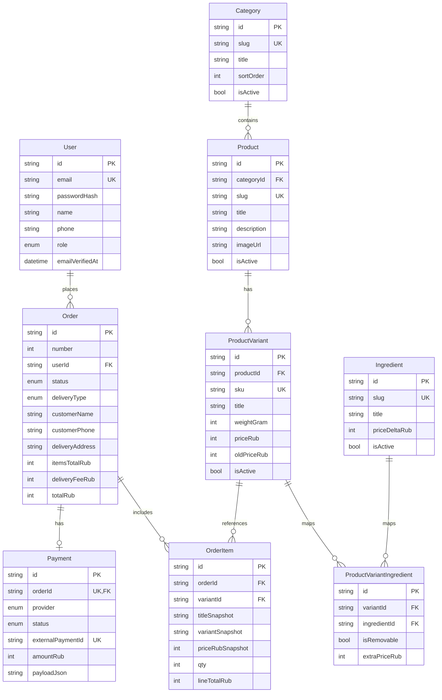

# ER-диаграмма (Бургер Сайз)

```mermaid
erDiagram
  User ||--o{ Order : places

  Category ||--o{ Product : contains
  Product ||--o{ ProductVariant : has

  ProductVariant ||--o{ ProductVariantIngredient : maps
  Ingredient ||--o{ ProductVariantIngredient : maps

  Order ||--o{ OrderItem : includes
  ProductVariant ||--o{ OrderItem : references

  Order ||--o| Payment : has

  User {
    string id PK
    string email UK
    string passwordHash
    string name
    string phone
    enum role
    datetime emailVerifiedAt
  }

  Category {
    string id PK
    string slug UK
    string title
    int sortOrder
    bool isActive
  }

  Product {
    string id PK
    string categoryId FK
    string slug UK
    string title
    string description
    string imageUrl
    bool isActive
  }

  ProductVariant {
    string id PK
    string productId FK
    string sku UK
    string title
    int weightGram
    int priceRub
    int oldPriceRub
    bool isActive
  }

  Ingredient {
    string id PK
    string slug UK
    string title
    int priceDeltaRub
    bool isActive
  }

  ProductVariantIngredient {
    string id PK
    string variantId FK
    string ingredientId FK
    bool isRemovable
    int extraPriceRub
  }

  Order {
    string id PK
    int number
    string userId FK
    enum status
    enum deliveryType
    string customerName
    string customerPhone
    string deliveryAddress
    int itemsTotalRub
    int deliveryFeeRub
    int totalRub
  }

  OrderItem {
    string id PK
    string orderId FK
    string variantId FK
    string titleSnapshot
    string variantSnapshot
    int priceRubSnapshot
    int qty
    int lineTotalRub
  }

  Payment {
    string id PK
    string orderId UK,FK
    enum provider
    enum status
    string externalPaymentId UK
    int amountRub
    string payloadJson
  }
```

